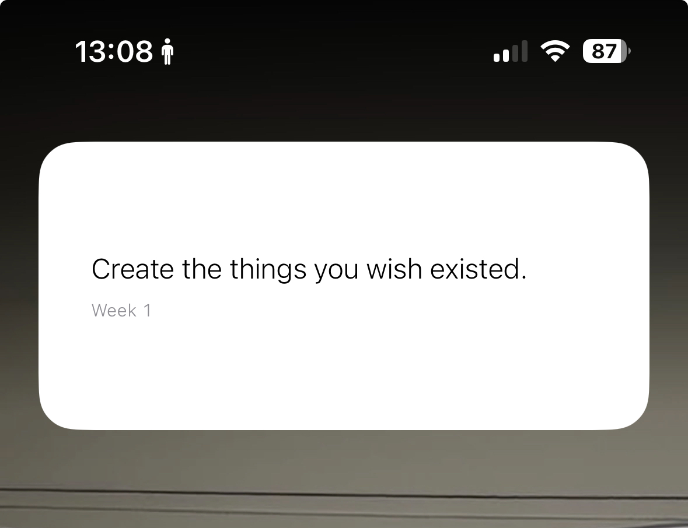
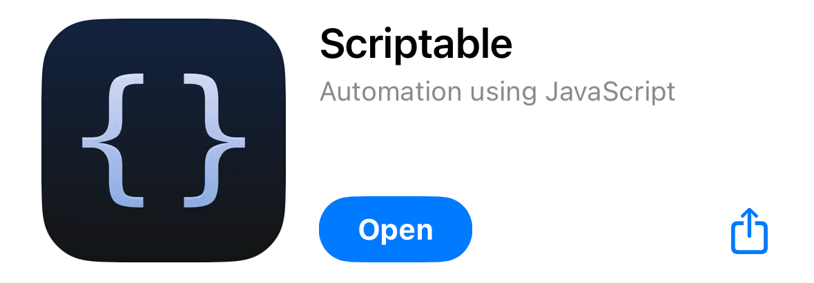

## Weekly Quote Widget

A simple project that displays a custom weekly quote on your iPhone Home Screen using a Scriptable widget. The quote is managed in this repository and served via a static Next.js site on GitHub Pages.

### Preview

<!-- Add your screenshot here -->
<!-- Example:  -->

  

 

### How It Works

1.  A Next.js application builds a static HTML page containing the quote.
2.  This static site is hosted for free using GitHub Pages.
3.  A Scriptable widget on an iPhone fetches the HTML content of the page.
4.  The script parses the HTML to find the quote, author, and week number.
5.  The widget then displays this information on the Home Screen.

### Installation Guide

Follow these steps to set up the widget on your iPhone.

#### Step 1: Install Scriptable app on the AppStore

  

#### Step 2: Create a New Script

1.  Open the Scriptable app.
2.  Tap the `+` icon in the top-right corner to create a new script.
3.  Tap on the script name at the top (e.g., "Untitled Script") and rename it to something memorable, like `Weekly Quote`.
4.  Copy the entire code here: [Widget Source Code](./script.js) into the script editor, replacing any existing content.
